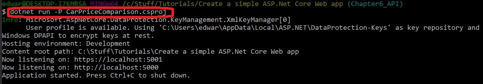

# CarWebApp
API that will allow you to
- Add a new cars to the database
- Add Multiple pictures of each car to the database


## Prerequisites / getting set up

**ONE**

If you do not have vscode and / or .Net Core already installed, then  I have explained how to do this [right here](https://www.youtube.com/watch?v=k873eektwkw "Ted Talks")

You will need to install Bower so that you can download the libraries needd for this project. (See step TWO). Go to https://bower.io to learn about Bower and download it.

**TWO**

Download the libraries you need to make this project work. You will use Bower to help you do this. Using a command prompt, change directory to the same directory that contains the project file 'CarPriceComparison.csproj'. Now run the command 'bower install'.

After running the bower install command, you will notice you have the packages you need.

 
   
running 'bower install' will download and install te required packages. This is because descriptions of these packages are held in the bower.json file, so bower 'knows' to find them online and download them.

The next thing to do is to build and run the project. The following assumes you are in a command prompt of your choice (I personally use git bash) and ensure you have changed directory to the directory containing the 'CarPriceComparison.csproj' file. run the following command.

dotnet build CarPriceComparison.csproj

After a short while you should see a message saying the build was successful.


Go ahead and run the project. 



## Using the API - endpoints.

**Adding a brand new vehicle**

POST a brand new car to the database (as of October 2019, not - authenticated)

Expected return code : 201 Created

http://localhost:5000/api/vehicles

Body
```
{
	"CityFuelEconomy" : 10.1,
	"HighwayFuelEconomy" : 9.8,
	"ListPrice" : 12000.00,
	"IsSold" : "True",
	"SoldPrice" : 11500.00,
	"ModelForeignKey" : 1,
	"DealerForeignKey" : 1,
	"Notes" : "Wednesday 13th November 2019", 
	"Color" : "White"
}
```
NOtice how the above Json contains foreign Keys for the Car Model and the Dealer. Any new car has these. Multiple cars can belong to the same dealership.

**Adding picture(s) for a given vehicle**

POST - Pictures uploaded as a base64 encoded string (As of October 2019, not authenticated)

http://localhost:5000/api/vehicles/{vehicleId_}/Pictures

Example (where 1005 is the required Vehicle Id)

http://localhost:5000/api/vehicles/1005/Pictures

TODO NOT SURE WHY VEHICLE ID IS SUPPLIED IN THE URL AND IN THE JSON - LOOK INTO THIS

Body
```
{
	"Image" : '234234234234',
	"VehicleForeignKey" : 1005
}
```
Response
TODO - notice how the vehicleForeignKey is returned as 0 - NEEDS FIXING
{"image":"Your Base64 string for veh 1005 here","vehicleForeignKey":0}

**Retrieving a picture for a given vehicle**

GET - Picture retrieved as a base 64encoded string

http://localhost:5000/api/vehicles/{vehicleId}/pictures/{pictureId}

Example - where vehicleId = 1005 and pictureId = 13

http://localhost:5000/api/vehicles/1005/pictures/13

Example of Json returned :- (TODO vehicleForeignKey IS ALWAYS RETURNED AS 0, NOT THE REQUIRED VALUE FIX THIS)

Status : 200 OK

```
{
    "image": "Your Base64 string for veh 1005 here",
    "vehicleForeignKey": 0
}
```

An Exception will be thrown if invalid data is entered. Case 1. Invalid Integer vehicleId

http://localhost:5000/api/vehicles/10054737292929292929/pictures/13

Status : 400 Bad Request

```
{
    "vehicleId_": [
        "The value '10054737292929292929' is not valid."
    ]
}
```

Case 2. Invalid Integer pictureId. 
http://localhost:5000/api/vehicles/1005/pictures/13293

Status 204 : No Content  TODO - No meaningful Error message returned as in Case 1. Fix this


