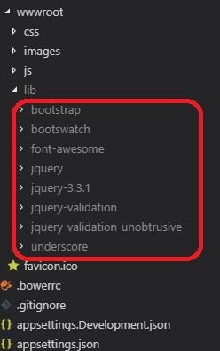

# CarWebApp
API that will allow you to
Add a new car to the database
Add Multiple pictures of one car to the database

## Prerequisites / getting set up

ONE

If you do not have vscode and / or .Net Core already installe, then  I have explained how to do this [right here](https://www.youtube.com/watch?v=k873eektwkw "Ted Talks")
You do not absolubtley HAVE to use vscode. Hosever, it was my IDE of choice for this project.

You will need to install Bower so that you can download the libraries needd for this project. (See step TWO). Go to https://bower.io to learn about Bower and download it.

TWO

Download the libraries you need to make this project work. You will use Bower to help you do this.
If you do not have the packages already installed, then you will notice two things.
    1. The libraries you need are NOT in the 'wwwroot/lib' folder. Notice how in the screenshot below you can see libraries such as boorstrap, bootswatch, font-awesome etc, etc. If you have not installed and run Bower, you will NOT be able to see these.

     

