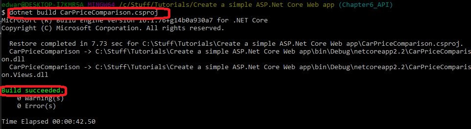

# CarWebApp
API that will allow you to
- Add a new cars to the database
- Add Multiple pictures of each car to the database


## Prerequisites / getting set up

**ONE**

If you do not have vscode and / or .Net Core already installed, then  I have explained how to do this [right here](https://www.youtube.com/watch?v=k873eektwkw "Ted Talks")

You will need to install Bower so that you can download the libraries needd for this project. (See step TWO). Go to https://bower.io to learn about Bower and download it.

**TWO**

Download the libraries you need to make this project work. You will use Bower to help you do this. Using a command prompt, change directory to the same directory that contains the project file 'CarPriceComparison.csproj'. Now run the command 'bower install'.

After running the bower install command, you will notice you have the packages you need.

 
   
running 'bower install' will download and install te required packages. This is because descriptions of these packages are held in the bower.json file, so bower 'knows' to find them online and download them.

The next thing to do is to build and run the project. The following assumes you are in a command prompt of your choice (I personally use git bash) and ensure you have changed directory to the directory containing the 'CarPriceComparison.csproj' file. run the following command.

dotnet build CarPriceComparison.csproj

After a short while you should see a message saying the build was successful.



Go ahead and run the project. 


## Using the API - endpoints.

**Adding a brand new vehicle**

POST a brand new car to the database (as of October 2019, not - authenticated)

Expected return code : 201 Created

http://localhost:5000/api/vehicles

Body
```
{
	"CityFuelEconomy" : 10.1,
	"HighwayFuelEconomy" : 9.8,
	"ListPrice" : 12000.00,
	"SoldPrice" : 11500.00,
	"ModelForeignKey" : 1,
	"DealerForeignKey" : 1,
	"Notes" : "Saturday 5 October", 
	"Color" : "White"
}
```
NOtice how the above Json contains foreign Keys for the Car Model and the Dealer. Any new car has these. Multiple cars can belong to the same dealership.

NOTE TO SELF - the Id for the above is 1012


